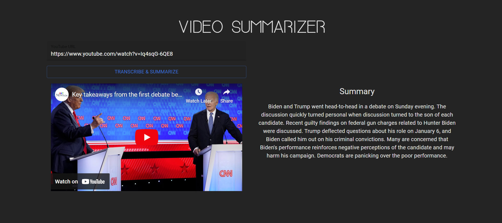

# YouTube Video Summarizer

This project is a video summarizer application developed using Python, React, and TypeScript. It leverages Cohere's speech-to-text API to transcribe videos and summarize their content. The application is hosted on Google Cloud Platform (GCP) and provides users with the ability to input YouTube video URLs, analyze the content, and display a summarized version of the video's transcript.

## Features

- Transcribes YouTube videos to text using Google's Speech-to-Text API.
- Summarizes video content to provide concise insights using Cohere's Summarize API.
- Frontend built with React and TypeScript, audio clips hosted on Google Cloud Platform

## Technologies Used

- Python
- React
- TypeScript
- Cohere API (speech-to-text)
- Google Cloud Platform (GCP)

## Getting Started

To run this application locally, follow these steps:

1. Clone the repository.
2. Install dependencies using `npm install` (for frontend) and `pip install -r requirements.txt` (for backend).
3. Set up your environment variables for Cohere API credentials and other necessary configurations.
4. Start the frontend development server with `npm start`.
5. Start the backend server with `python app.py`.

## Usage

1. Enter a valid YouTube video URL into the provided input field.
2. Click on the "Transcribe & Summarize" button to initiate the analysis.
3. View the summarized transcript and video embed side by side once the analysis completes.

## Contributing

Contributions are welcome! Please fork the repository and submit pull requests to propose improvements or new features.
